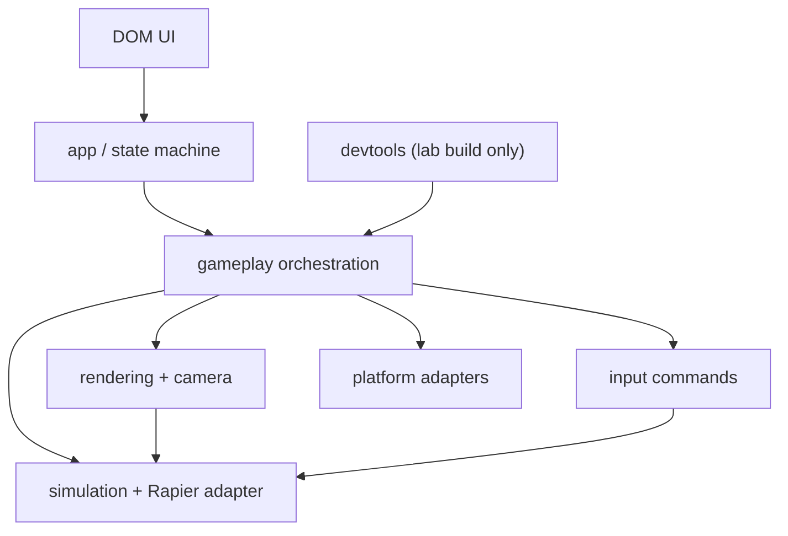

# Architecture

## Decision

Teetertown begins as a strict-TypeScript modular monolith built with Vite, direct imperative
Three.js, exact-pinned Rapier 3D WASM, plain DOM UI, Vitest, and Playwright. One renderer and canvas
serve the runtime. No React reconciler or full ECS participates in the physics-critical path.

## Dependency direction

`src/simulation` imports neither Three.js nor browser/DOM, UI, analytics, storage, ad, IAP, or
platform modules. Rendering may read immutable simulation snapshots. No reverse import is allowed.

## Authority contract

| State                                                   | Owner                     | Writes                                             | Readers                              |
| ------------------------------------------------------- | ------------------------- | -------------------------------------------------- | ------------------------------------ |
| Objectives, result, fixed-step timers, commands, replay | Simulation/session        | Fixed-step command/rule handlers                   | Gameplay, rendering, UI, diagnostics |
| Pose, velocity, contacts, sleep, joints                 | Rapier world              | Rapier fixed step and explicit simulation commands | Snapshot capture/rules               |
| Raw pointer sample                                      | Pointer input owner       | Pointer Events until quantization                  | Command sampler                      |
| Previous/current snapshot                               | Simulation snapshot store | After each fixed step                              | Rendering/interpolation, replay hash |
| Camera/material/VFX/DOM                                 | Rendering/UI              | Presentation loop/events                           | Player                               |
| Settings/profile/save                                   | Platform/meta             | Stable boundaries outside active physics step      | App/UI                               |

Three.js transforms never write back into dynamic Rapier bodies. Kinematic poses, resets, rewinds,
and topology changes enter through explicit fixed-step simulation commands.

## Boot sequence

1. `boot`
2. register/update the production service worker and activate a fully verified waiting release only
   at the session boundary;
3. validate compiled release ID against the active manifest;
4. `capability_check`;
5. async Rapier singleton initialization;
6. deterministic tiny-world self-test;
7. content/material validation;
8. minimum view creation;
9. simulation-world construction in stable ID order;
10. renderer/view binding;
11. `ready`, then `playing`.

Input is disabled until ready. A failed self-test transitions to `fatal_error`; it never creates a
fallback world.

## Release identity and offline lifecycle

The production build emits a schema-2 manifest and service worker after all Vite assets exist. One
release ID binds SHA-256 hashes for the client, Rapier WASM, HTML, styles, and shell assets. The
candidate worker verifies every response before committing the candidate cache and waits until the
next boot to activate. Any missing/corrupt response deletes the candidate. The active worker serves
one release-namespaced cache and removes the prior cache only after activation. See ADR-0013.

## Rapier runtime packaging

Node simulation checks use exact `@dimforge/rapier3d-compat@0.19.3`. Vite browser builds alias that
API surface to exact `@dimforge/rapier3d@0.19.3`, emitting WASM as a same-origin asset rather than
embedding it in JavaScript. The singleton bootstrap handles the two official initialization
contracts, but each session uses exactly one runtime.

Replay schema 2 records `compat-embedded-node` or `modular-wasm-browser`. The semantic Rapier
version alone is not sufficient identity because the two official package binaries are not
byte-identical. See ADR-0018.

## Runtime states

`boot`, `capability_check`, `loading`, `ready`, `tutorial`, `playing`, `paused`, `rewinding`,
`success`, `failure`, `transition`, `context_lost`, `recovering`, and `fatal_error` use one typed
transition table. UI callbacks request transitions or enqueue commands; they do not mutate physics.

## Fixed update

- 1/60-second step; at most five catch-up steps per render.
- Large gaps are clamped and recorded.
- One quantized target-tilt command is applied per fixed step.
- Rapier steps once; ordered rule processing follows; assertions run; previous/current snapshots
  rotate; replay command/hash recording completes.
- Contact events are canonicalized before rules consume them. A changed quantized command wakes
  sleeping dynamic bodies in stable entity order; an unchanged command preserves sleeping.
- Rendering interpolates with accumulator alpha and never feeds that pose into simulation.

## Level lifecycle

Each load creates one `LevelResourceScope` for Three geometries/materials/textures/render targets
and one simulation owning its Rapier world/event queue. Unload pauses simulation, releases pointer
capture, disposes the prior render scope, frees the prior Rapier resources, and emits current
counters. Future listeners, timers, subscriptions, workers, and audio handles join explicit scopes
before use. A resource-count increase after warm-up blocks the lifecycle gate.

Frame and physics timings use fixed-capacity 2,048-sample typed rings. The lab exposes percentile,
long-task, draw/triangle, and explicit resource counters; profiling computes heap/DOM trends outside
the app through Chrome DevTools Protocol so memory diagnostics do not influence simulation.

## Build separation

- Production mode tree-shakes internal controls and fault injection.
- Lab mode includes scene/experiment selection, overlays, stepping, replay, counters, and diagnostic
  export.
- A production-bundle audit rejects internal lab markers and privileged controls.

## Future adapters, not implementations

Versioned IndexedDB storage, analytics, diagnostics, remote config, audio lifecycle, haptics, share,
ads, IAP, identity/cloud save, and daily/leaderboard services are interfaces. Phase 1 implements
local storage/diagnostics and fake no-op platform boundaries only.
